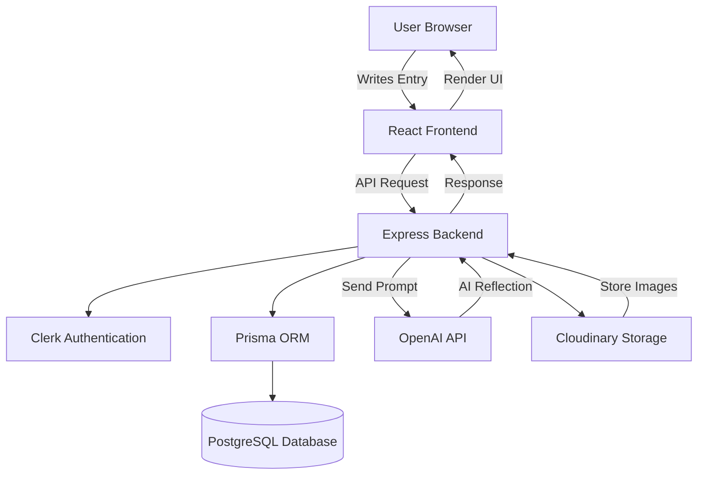

# Mirror Journal  
> Built as a full-stack project to demonstrate real-world AI integration

**Mirror Journal** is a personal AI-powered journaling application designed to go beyond traditional note-taking. Instead of simply storing your thoughts, it helps you reflect, understand, and gain clarity through intelligent AI-generated responses.

The goal of this project is to simulate a real-world product where modern frontend technologies, backend architecture, and AI capabilities work together seamlessly. It acts like a digital companion — allowing users to freely express themselves while receiving thoughtful reflections that encourage deeper thinking and self-awareness.

This project demonstrates how AI can be integrated into everyday applications to create meaningful, user-centric experiences.

---

🌐 **Live Demo:** https://mirror-journal.vercel.app  

---

## ✨ Features

- 📝 **Rich Text Editor** — Write beautifully formatted journal entries (Tiptap)
- 🤖 **AI Reflections** — Get meaningful, human-like responses powered by OpenAI
- 😊 **Mood Tracking** — Track emotions and identify patterns over time
- 📊 **Dashboard** — Visualize journaling activity and consistency
- 📚 **Archives** — Access and revisit all past entries
- 🌙 **Dark Mode** — Clean, distraction-free writing experience
- 🖼️ **Image Uploads** — Upload and attach images via Cloudinary

---

## 🧠 How It Works

1. User writes a journal entry  
2. Entry is sent to backend (Express + Prisma)  
3. AI processes the entry using OpenAI  
4. Reflection + entry is stored in PostgreSQL  
5. Dashboard visualizes mood and activity  

---

## 🏗️ Architecture Diagram

## 📈 What I Learned
- Designing and building a full-stack application from scratch
- Structuring a scalable backend using Express and Prisma
- Integrating AI into real user workflows using OpenAI APIs
- Handling authentication securely with Clerk
- Managing database schema and relationships in PostgreSQL
- Deploying production-ready apps using Vercel and Render

## 🚧 Future Improvements
- 🔔 Daily journaling reminders and notifications

## ⭐ Support

If you like this project, consider giving it a star ⭐
